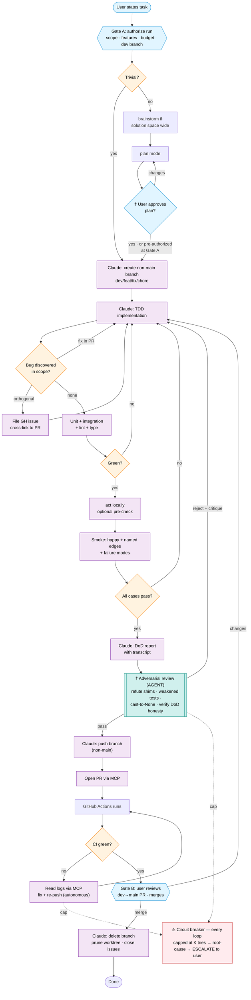
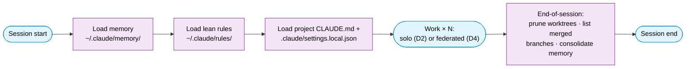
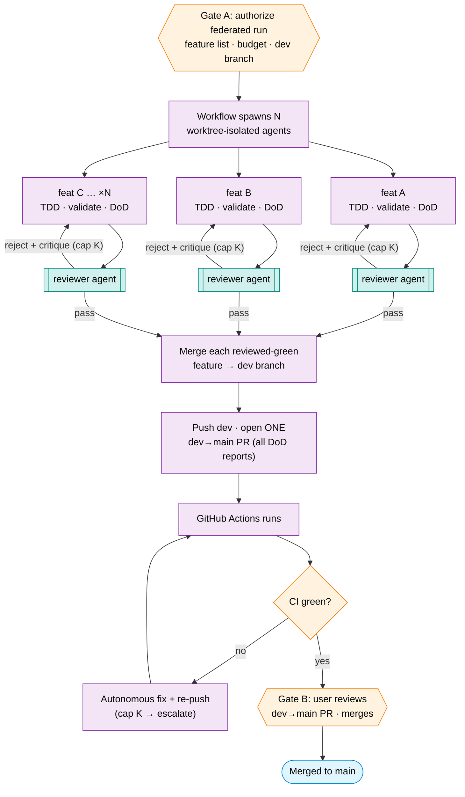

# Development Control Flow — rev 2

## Status
Revision 2, with rev-3 changes in progress. Was synced with
`specs/2026-05-31-branch-tier-autonomy-design.md` (rev 2) and
`diagrams/branch-tier-autonomy.md`. Lives in this directory for iteration.
When ratified, the rule files promote to `~/.claude/rules/` and this document
moves to `docs/claude-process.md` (or equivalent) as the master reference for
how we work together.

**Rev 3 (in progress):** the rules set is re-sorted by mechanism.
`single-tracker.md` deleted (invariant → pre-commit hook; principle →
constitution; practices → `branch-lifecycle.md`). `local-ci-parity.md` demoted
from a global rule to project reference (`docs/references/`). `no-shed` thinned.
The DoD / no-shed / tracker / CI principles are staged for the constitution
(§15). The mechanism model now treats global `CLAUDE.md` as the always-on
*constitution* tier above the on-demand *topical rules* (§1, D1). Spec sync (the
rev-2 snapshot) is pending. **No global config touched — the constitution
additions are staged in §15 only, applied at promotion.**

**Diagram source of truth:** the mermaid blocks in
`diagrams/branch-tier-autonomy.md`. The diagrams embedded here are copies for
readability. If they ever disagree, the diagrams file wins.

## Purpose
This is the network diagram of how we develop together. It defines:

1. **The mechanism model** — four mechanisms, each for a distinct kind of
   concern, filed by trust model.
2. **Architecture** — what components exist, where they live, which mechanism
   each one is.
3. **Control flow** — how a single unit of work moves through the system, in
   two execution modes (interactive and autonomous).
4. **Branch tiers** — `main` is protected; everything else is Claude's sandbox.
5. **Responsibility split** — who does what; where the two human gates sit.

If you can't trace what should happen for a given task by following this
document, the document has a gap. Flag it.

---

## 1 — The mechanism model (the backbone)

Four mechanisms, each for a distinct kind of concern:

| Mechanism | For | Session-context cost | Trust model |
|---|---|---|---|
| **Hooks** | Hard invariants | **zero** (always on) | mechanical — un-bypassable by a forgetful agent |
| **Rules** | Judgment / discipline (two tiers — see below) | constitution always-on; topical files on-demand | guides a thinking agent (works with a human present) |
| **Agents** | Fixed-prompt specialists | **zero until invoked** | invoked by an orchestrator with fixed inputs — implementer can't game them |
| **Workflows** | Autonomous orchestration | **zero until dispatched** | deterministic control flow (caps, gates, fan-out) in code |

**Principle:** safety-critical control (main protection, shim-catching, retry
caps) lives in hooks / agents / workflows — **never** in rules. Rules are for
the judgment a thinking agent applies when a human is in the loop.

### The rules mechanism has two tiers

The single "Rules" mechanism splits by *when it loads*:

- **Constitution** — global (`~/.claude/CLAUDE.md`) + project (`<repo>/CLAUDE.md`).
  Always loaded, every session. Holds the short, universal *stances* you never
  want forgotten (the DoD principle, the no-shed principle, the single-tracker
  principle). Because it is always-on, it must stay short.
- **Topical rules** — `~/.claude/rules/*.md`. The substantial, procedural detail
  for one concern (DoD's surface-by-type playbook, branch-lifecycle's cleanup
  commands, no-shed's orthogonality tests). **Target loading: on-demand** — read
  when the work touches them, so a session pays context only for relevant rules.

> **Known gap (rev 3):** today the harness auto-injects *all* `~/.claude/rules/*.md`
> every session, so the on-demand saving isn't realized yet. Making topical rules
> genuinely on-demand (per `CLAUDE.md`'s own "read when relevant" intent) is the
> one change that turns the shrink effort into real token savings. It is a
> loading/config change applied at promotion, not a content change.

---

## 2 — Architecture (the network) — D1

What exists, where it lives, and which of the four mechanisms each piece is.

```mermaid
graph TB
    subgraph Actors
        U["User"]
        C["Claude session"]
    end

    subgraph GLOBAL["Global config — ~/.claude/ · THE FOUR MECHANISMS"]
        HOOKS["git hooks — HOOKS (invariants)<br/>pre-commit: forbidden trackers + no-main<br/>pre-push: reject main/master ref"]
        CONST["CLAUDE.md — CONSTITUTION (always-on)<br/>universal stances: DoD · no-shed · tracker<br/>(RULES mechanism · tier 1)"]
        RULES["rules/*.md — TOPICAL RULES (on-demand)<br/>DoD detail · no-shed tests · branch-lifecycle<br/>(RULES mechanism · tier 2)"]
        AGENTS["agents/*.md — AGENTS (specialists)<br/>adversarial-reviewer (fixed prompt)"]
        WF["workflows/*.js — WORKFLOWS<br/>autonomous federated run<br/>(invokes reviewer; caps in code)"]
        SETT["settings.json — allow/deny<br/>tier allows: push non-main + merge<br/>main denies: push main, --force"]
        MEM["memory/<br/>cross-session facts"]
    end

    subgraph PROJ["Per-project config"]
        PCM["&lt;repo&gt;/CLAUDE.md"]
        PPS["&lt;repo&gt;/.claude/settings.local.json"]
        PDOCS["&lt;repo&gt;/docs/ — ADRs, specs"]
    end

    subgraph EXT["External"]
        GH["GitHub — Issues + PRs<br/>branch protection on main"]
        ACT["GitHub Actions CI"]
        GHM["GitHub MCP server"]
        PWM["Playwright MCP server"]
    end

    U -->|"Gate A: authorize · Gate B: merge PR"| C
    HOOKS -.->|mechanically enforce| C
    SETT -.->|allow / deny| C
    CONST -.->|always guides| C
    RULES -.->|read when relevant| C
    AGENTS -.->|invoked by| C
    WF -.->|dispatched by| C
    MEM -.->|loaded into| C
    PCM -.-> C
    PPS -.-> C
    PDOCS -.-> C

    C -->|issue / PR ops| GHM
    C -->|UI smoke tests| PWM
    C -->|"git push (non-main)"| GH
    GHM <--> GH
    GH --> ACT
    ACT -.->|logs readable via| GHM

    classDef userAction fill:#e1f5ff,stroke:#0288d1,color:#000
    classDef claudeAction fill:#f3e5f5,stroke:#7b1fa2,color:#000
    classDef agent fill:#d0f0ed,stroke:#00897b,color:#000
    classDef wf fill:#e8f0fe,stroke:#3367d6,color:#000

    class U userAction
    class C claudeAction
    class AGENTS agent
    class WF wf
```

**Reading notes**

- The four mechanisms, by trust model: **hooks** make invariants un-bypassable
  (zero context, always on); **rules** guide a thinking agent in two tiers — the
  always-on *constitution* (`CLAUDE.md`) and the *topical files* (`rules/*.md`,
  today auto-injected but targeted to load on-demand); **agents** are fixed-prompt
  specialists invoked with fixed inputs (zero context until invoked — the
  implementer can't game them); **workflows** encode autonomous orchestration
  with caps/gates in code.
- `settings.json` is the allow/deny layer that *works with* the pre-push hook to
  protect `main`; `memory/` is storage. Neither is one of the four mechanisms.
- The user has two routine action arrows into the world: **Gate A** (authorize a
  run) and **Gate B** (merge the `dev→main` PR). Push of non-`main` branches is
  now a Claude action.

---

## 3 — Branch tiers

- **`main` — protected.** Never pushed/merged/committed-to directly; reached
  only via a PR the user merges.
- **All non-`main` — Claude's sandbox** (`dev/feat/fix/chore/integration/*`):
  create, commit, push, merge-between, open PRs autonomously.
- **Invariant:** *nothing reaches `main` without the user's explicit PR merge.*

---

## 4 — Gate model

Two routine human touchpoints, attached to the `main` boundary:

| # | Gate | Trigger | Mechanism | If rejected |
|---|---|---|---|---|
| A | **Authorize** | Up front: scope, feature set, budget, target dev branch | User states task + authorizes | Re-scope |
| B | **Merge** | PR open and CI green | User reviews `dev→main` PR on GitHub, merges | Comments → Claude commits fixes |

Plus one **exception** touchpoint: **escalation** when the circuit breaker
trips (§9). Routine = two touchpoints; you are pulled in mid-run only when
something is genuinely wrong.

The rev-1 mid-flow **DoD-acceptance gate** is gone in autonomous mode — its
skepticism is now the adversarial-reviewer agent (§8). The rev-1 **push gate**
(user runs `git push`) is gone — Claude pushes non-`main` branches autonomously.

Gate A may include **plan pre-authorization** ("come up with your own plan, I
trust you"), short-circuiting the plan-approval step in autonomous mode. Default
is user review of the plan.

Gate A also ensures **GitHub issue scaffolding** is in place: each feature being
worked on must have a linked GitHub issue (provided by the user or created by
the workflow). This gives escalation (§9) a durable, visible target.

---

## 5 — Per-task discipline (two execution modes) — D2

The per-task control flow is a **spec of discipline** — not itself a rule, not
itself a workflow. It has two execution modes:

- **Interactive / solo** (a single feature, human in the loop): the main loop
  follows the discipline conversationally; **the human is the skeptic** (plan
  approval, PR review). A workflow cannot hold this conversation, so this mode
  stays main-loop.
- **Autonomous** (the federated run D4, and authorized single-feature runs):
  encoded as a **workflow**, dispatched after Gate A. The **adversarial-reviewer
  agent is the skeptic** (a mandatory stage); retry caps + escalation are
  enforced in workflow code.

The autonomous mode is drawn below. In interactive mode, the plan-approval gate
is always active (no short-circuit), the human replaces the reviewer agent at
Gate B / PR review, and the human may optionally invoke the reviewer agent as a
courtesy pre-check.

**Reading notes**

- **Two execution modes.** *Interactive / solo:* the main loop follows this same
  discipline conversationally, and **the human is the skeptic** (plan approval,
  PR review) — a workflow can't hold that conversation, so it stays main-loop.
  *Autonomous* (drawn here, and the federated run D4): encoded as a **workflow**;
  the **reviewer agent is the skeptic**; caps + escalation are in code.
- **Gate A** moves up front (authorize the run). The rev-1 mid-flow
  *DoD-acceptance* gate is **gone** in autonomous mode — its skepticism is now
  the teal reviewer agent. **Gate B** is the `dev→main` PR merge.
- The **plan-approval gate** defaults to user review. In autonomous mode, it can
  be **short-circuited** when the user pre-authorizes plan autonomy at Gate A
  ("come up with your own plan, I trust you"). Trivial tasks skip planning
  entirely.
- **Push is now a Claude action** for non-`main` branches (rev-1 made the human
  push). Nothing still reaches `main` without the user's Gate-B merge.
- The CI-red loop (read logs → fix → re-push) and the reviewer-reject loop
  (reviewer rejects → back to implementation) are **autonomous** but **capped at
  K** (default ~3). Exhaustion triggers root-cause diagnosis, then escalation —
  never an infinite loop, never a shim.
- **†** In **interactive mode**, these nodes change roles: the plan-approval gate
  is always human-reviewed (no short-circuit); the adversarial-reviewer agent is
  replaced by the human at Gate B / PR review.

---

## 6 — Session lifecycle — D3

The per-task flow runs *inside* a session. The work phase is now explicitly
either solo (D2) or federated (D4).

- Memory facts are written **the moment they're learned** (durability against an
  abrupt end), then **consolidated** in the end-of-session sweep (tidiness).
- The work phase is N iterations of either the solo per-task flow (D2) or one
  federated multi-feature run (D4).

---

## 7 — Federated multi-feature run — D4

The capability branch-tier autonomy unlocks. **One workflow** fans out one
worktree-isolated agent per feature, gates each with the **reviewer agent**
before it merges onto the dev branch, then opens a single `dev→main` PR. Retry
caps + escalation live in the workflow code.

**Reading notes**

- D4 **nests** D3 (it is one "Work" iteration) and contains N **cores** of D2
  (implement → validate → DoD → review) run concurrently — not N full D2s. The
  push / PR / CI / Gate-B tail happens **once** for the whole batch.
- The reviewer agent gates **each feature** before it merges onto dev, so a
  shimmed feature never reaches the shared branch.
- Two human touchpoints for the whole batch: **Gate A** (authorize) and **Gate
  B** (merge). Escalation only fires when a cap is exhausted.

---

## 8 — Adversarial review (the autonomous skeptic)

- **What:** a fixed-prompt **agent** (`~/.claude/agents/adversarial-reviewer`).
  Refute-first. Input: the diff + the DoD report + test output. Output: a
  structured verdict (pass / fail + specific findings). Hunts for skipped or
  weakened tests, `try/except pass`, hardcoded returns, cast-to-`None`, narrowed
  assertions, unaddressed root cause, missing named edge cases, and **dishonest
  DoD claims** (does the report match the actual test output?).
- **Where:** a **mandatory stage in the autonomous workflow**, after validation
  + DoD report, before push/integrate. Reject → back to implementation **with
  the critique** (autonomous retry, subject to the cap). In the federated run it
  runs **per feature**, before that feature merges onto the dev branch.
- **Why mechanical, not a rule:** the implementer must not be trusted to summon
  and honestly report its own critic. The **workflow** invokes the reviewer with
  fixed inputs; the implementer cannot skip or game it.
- **Interactive mode:** the **human** plays this role at Gate B / PR review.
  (The agent may optionally be invoked as a courtesy pre-check, but when a human
  is present the human is the real reviewer.)
- **Verdict persistence:** reject verdicts are transient — passed directly to
  the implementing agent as retry context (the critique is the input). The
  **passing verdict** is appended to the DoD report as a `## Reviewer Verdict`
  section, traveling with the PR to Gate B.

---

## 9 — Circuit breaker (no insane loops, no shims)

- Every retry loop (validation, review-reject, CI) has a **hard cap of K
  iterations**, enforced in workflow code (a counter — not a rule a grinding
  agent can ignore).
- On exhaustion: dispatch a **root-cause diagnosis**; if still unresolved,
  **escalate to the user** — never loop again, never shim.
- `K` is configurable (default ~3). The cap defeats both compute-burning grind
  and the temptation to shortcut once "just make it pass" gets hard.
- **Escalation mechanism:** on exhaustion, the workflow posts a structured
  comment to the feature's **GitHub issue** (what failed, attempts made,
  root-cause diagnosis, branch/PR state), adds a `needs-human` label, and
  **exits**. The branch and PR are left in place for human inspection. To
  resume: the human investigates, fixes or directs, and re-authorizes via a
  new Gate A.

---

## 10 — Enforcement of `main` protection (three layers)

1. **GitHub branch protection on `main`** (server-side, the real guarantee):
   require PR + ≥1 approval; block direct/force pushes. One-time admin setup.
2. **Global `pre-push` hook**: rejects any push whose remote ref is
   `main`/`master`, in any command form. Closes the bare-`git push` gap. Chains
   to the repo-local pre-push hook (global `core.hooksPath` shadows it
   otherwise).
3. **Global `settings.json`**: allow `git push` for tier branches
   (`dev/*`, `feat/*`, `fix/*`, `chore/*`, `integration/*`); deny `git push
   origin main`, `--force`, `-f`; pre-commit guard against committing on `main`.

### Hooks (intended logic)

**`pre-push`** — stdin is `<local-ref> <local-sha> <remote-ref> <remote-sha>`:
reject if `remote-ref` ∈ protected set (`${GIT_PROTECTED_BRANCHES:-main master}`,
per-repo override); then **chain to the repo-local hook**: look for
`<repo>/.git/hooks/pre-push`; if it exists, execute it with the same stdin and
arguments, and propagate its exit code (if the repo hook rejects, the push
fails). This is necessary because global `core.hooksPath` shadows repo-local
hooks — without explicit chaining, repo-specific checks (linters, custom
validations) would be silently skipped.

**`pre-commit`** — (a) reject staged forbidden tracker filenames
(`NEXT_STEPS|BACKLOG|TODO|PHASE_*`.md, `docs/issues-to-file.md`) — mechanically
enforcing the forbidden-tracker invariant; (b) reject commits while `main`/`master` is
checked out; then **chain to the repo-local pre-commit** (same mechanism: look
for `<repo>/.git/hooks/pre-commit`, execute if present, propagate exit code).

---

## 11 — Rules — shrink, don't grow

With mechanical concerns moved out, standing rules shrink to lean judgment:

| Rule | Disposition | Notes |
|---|---|---|
| `definition-of-done.md` | **keep, lean** | What "done" means; the DoD report contract. Stance elevated to the constitution; honesty is *also* enforced by the reviewer agent in autonomous mode. |
| `no-shed.md` | **keep, thin** | Principle elevated to the constitution; file keeps the orthogonality tests + the 5+-filings escalation. The shim taxonomy is *also* the reviewer agent's checklist. |
| `branch-lifecycle.md` | **keep, lean** | + the two-tier model; absorbs the cross-session resume anchor + docs-vs-tracking razor from the retired `single-tracker.md`. |
| `local-ci-parity.md` | **demoted — project reference** | Moved to `docs/references/`; principle elevated to the constitution; the `act` how-to is project-specific (only where GitHub Actions exists). |
| `single-tracker.md` | **deleted — redistributed** | Invariant → pre-commit hook; principle → constitution; practices → `branch-lifecycle.md`. |

**Not created** (category errors): `workflow-dispatch.md` (folds into Gate-A +
workflow code), `adversarial-review.md` (it is the reviewer agent + a workflow
stage).

**Net: 3 global rule files (`definition-of-done`, `no-shed`, `branch-lifecycle`),
down from 7. `single-tracker` deleted, `local-ci-parity` demoted to project
reference, and the load-bearing *principles* elevated to the always-on
constitution. Per-session topical context drops — fully realized once topical
rules load on-demand (see §1).**

**Constitution additions** (every elevated principle-line, staged for promotion —
**not applied to any live config**): see §15.

---

## 12 — Responsibility split

| Phase | Claude does | User does |
|---|---|---|
| Task definition | Listens, asks clarifying questions if scope ambiguous | States task (Gate A: authorizes scope, budget, branch) |
| Planning (non-trivial) | Drafts plan in plan mode | Approves plan (or pre-authorizes at Gate A) |
| Branching | Creates `dev/`, `feat/`, `fix/`, `chore/` branch | — |
| Implementation | TDD: write test → implement → green → refactor | — |
| Bug handling | Default: fix in-PR. Orthogonal: file GH issue + cross-link | Redirects if defer needed |
| Test validation | Runs unit, integration, regression, lint, type | — |
| Local CI pre-check | Optionally runs `act` | — |
| Smoke test | Playwright / curl / CLI exercise + named edges + failure modes | — |
| DoD report | Writes report with required transcript | — (autonomous) or reviews (interactive) |
| Adversarial review | Reviewer agent invoked with fixed inputs (autonomous) | Reviews PR at Gate B (interactive) |
| Push | Pushes non-`main` branch | — |
| PR open | Opens via GitHub MCP | — |
| CI monitoring | Reads logs via MCP, commits fixes (capped at K) | — |
| Merge | — (no main write privilege) | Reviews and merges `dev→main` PR (Gate B) |
| Cleanup | Deletes local + remote branch, prunes worktree, closes issues | Confirms if Claude asks |
| Memory update | Writes facts/preferences/feedback to `~/.claude/memory/` | — |

---

## 13 — Rule → enforcement-point mapping

Where each rule fires in the control flow:

| Rule | Enforced at | Mechanism |
|---|---|---|
| `definition-of-done.md` | DoD report (D2) + reviewer agent (autonomous) + Gate B (interactive) | Report structure required; reviewer agent verifies honesty; user verifies at merge |
| `no-shed.md` | Bug-discovered decision (D2) + reviewer agent checklist | Default-fix; orthogonal exception requires GH issue; reviewer catches shims |
| `branch-lifecycle.md` | Branch creation + cleanup (D2) | Naming convention at creation; mandatory delete at close |
| local-CI-parity *(project ref)* | Optional pre-check (D2) | `act` how-to now in project `docs/references/`; the expected-green principle in the constitution; real CI is the gate |
| forbidden-tracker invariant | pre-commit hook (commit time) | Forbidden filenames blocked at commit; principle in global `CLAUDE.md`; resume + docs-vs-tracking practices in `branch-lifecycle.md` |

---

## 14 — Resolved decisions

These were open questions during drafting; each is now decided.

1. **Trivial-task threshold** — ≤10 lines, single file, no behavior change (and
   no new import/dependency). Anything else goes through brainstorm/plan.

2. **Smoke test infeasible locally** — State it in the report, write the
   verification steps into the tracking GH issue (durable), and the user must
   explicitly accept the handoff.

3. **Multi-feature sessions** — One PR per logical feature, even small ones.

4. **Long-running tasks across sessions** — State carried by a branch +
   a GH issue with a live checklist (resume anchor) + a draft PR.

5. **Workflow templates** — The federated run (D4) is the primary workflow.
   Single-feature autonomous runs use D2 encoded as a workflow.

6. **CI-red diagnosis loop** — After a CI fix, re-run `act` + affected smoke
   cases, report as a delta. Full checking, abbreviated reporting.

7. **Memory writes during session** — Write immediately on learning
   (durability), then consolidate in the end-of-session sweep (tidiness).

8. **Cap on orthogonal-bug filings** — Soft surface at 5+ filings (status
   update; user redirects or confirms) — no hard stop.

9. **Named edge cases** — Stated acceptance criteria when they exist; otherwise
   derive from the surface and enumerate derived cases in the DoD report.

10. **Cross-project memory growth** — Deferred (memory hygiene, not dev control
    flow).

11. **Branch-tier autonomy** (rev 2) — `main` protected; all non-`main`
    branches are Claude's sandbox. Two routine gates (A: authorize, B: merge).

12. **Mechanism model** (rev 2) — Safety-critical control is mechanical (hooks /
    agents / workflows), not rules. Rules shrink to lean judgment.

13. **Adversarial review** (rev 2) — A fixed-prompt agent, not a rule. Mandatory
    workflow stage in autonomous mode; human plays this role in interactive mode.

14. **Plan approval short-circuit** (rev 2) — Plan approval defaults to user
    review. Can be pre-authorized at Gate A for autonomous runs.

15. **Three-tier judgment layer** (rev 3) — the "Rules" mechanism splits into
    the always-on *constitution* (`CLAUDE.md`, global + project) and the
    *topical rules* (`rules/*.md`, on-demand target). Constitution holds short
    universal stances; topical files hold procedural detail.

16. **On-demand topical rules** (rev 3) — `rules/*.md` should load on-demand
    (read when relevant), not be auto-injected every session. This is what turns
    the shrink into real token savings; it is a loading/config change applied at
    promotion, not a content change. (Today the harness auto-injects them — the
    known gap.)

17. **Rule sort** (rev 3) — `single-tracker` deleted, `local-ci-parity` demoted
    to project reference (`docs/references/`), `no-shed` thinned, principles
    elevated to the constitution. Net 3 global rule files.

---

## 15 — Constitution — staged for promotion

These are the principle-lines to add to the **always-on constitution** at
promotion. They are **staged here only — not applied to any live config.** The
*global* lines go to `~/.claude/CLAUDE.md` (under "Global defaults"); copy them
in when the rules promote, with the user's explicit go-ahead.

**Definition of Done (principle):**
> A change is not done until it has been exercised against the running system
> and a smoke-test transcript is in the report. Passing unit/integration tests
> is necessary, not sufficient. (Detail: `rules/definition-of-done.md`.)

**No-shed (principle):**
> Bugs found while implementing get fixed in the same change. Filing as an issue
> is only for genuinely orthogonal scope, or explicit user deferral — never an
> escape hatch to declare done. (Detail: `rules/no-shed.md`.)

**Single tracker (principle):**
> GitHub Issues is the only persistent cross-session tracker — file bugs,
> features, and follow-ups as issues, never as ad-hoc markdown. Generate status
> snapshots on demand from the source of truth; never hand-maintain them.
> (Resume / lifecycle detail: `rules/branch-lifecycle.md`.)

**Local-CI parity (principle):**
> Aim for an expected-green first push; a cheap local pre-check (`act`) is worth
> it where CI exists, but real CI is the gate. (Project how-to:
> `docs/references/local-ci-parity.md`.)

---

## Iteration protocol

When you spot a gap or disagreement:

1. Drop a comment inline (or in chat) referencing the section number.
2. We discuss; if we change a rule or gate, the rule file is updated and this
   document's diagrams regenerate to match.
3. Once you sign off on the whole document, the rules promote to
   `~/.claude/rules/` and this document moves to its final home.
