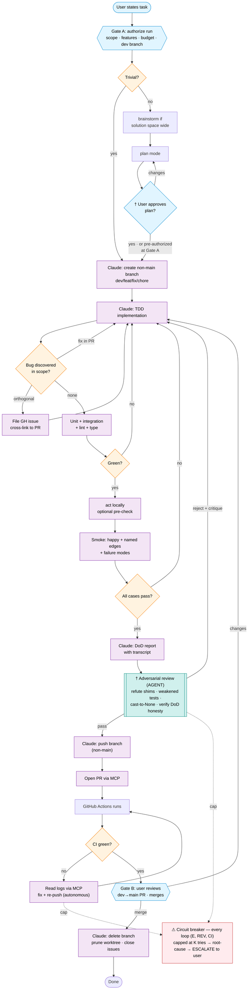
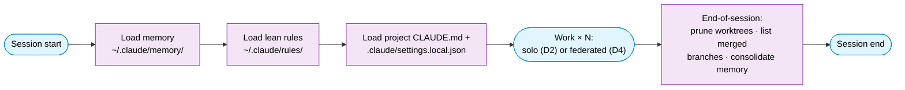
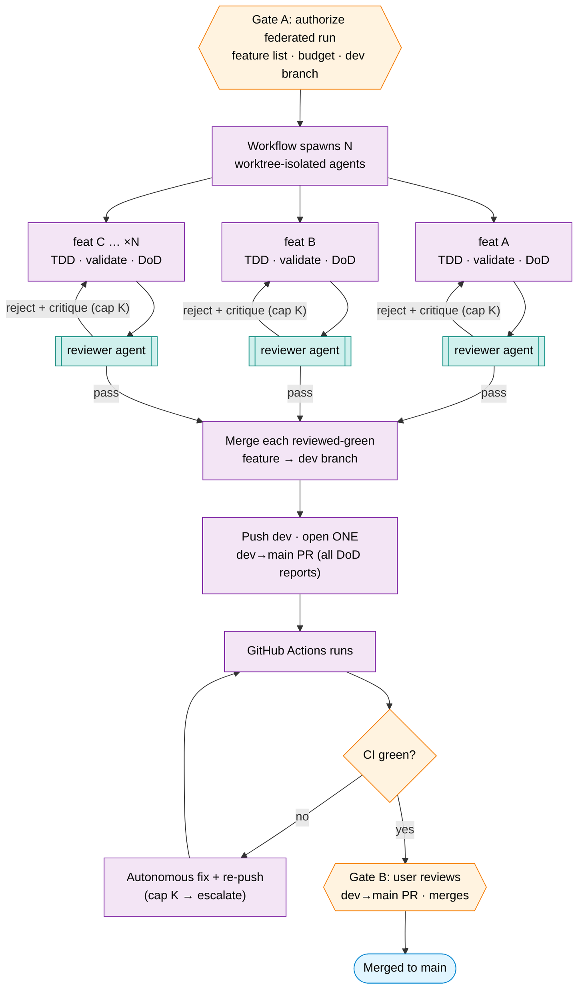

# Branch-Tier Autonomy + Mechanism Model — Diagrams (rev 2)

- **Date:** 2026-06-09 (reconstructed after canvas loss)
- **Source of truth:** these mermaid blocks. The Excalidraw canvas is a
  *rendering* of these, not the master. **If they ever disagree, this file
  wins.** (A laptop restart wiped the canvas on 2026-06-09; the canvas-only
  diagrams were lost. Never again — the text lives here.)
- **Spec:** `ClaudeDevCycle/specs/2026-05-31-branch-tier-autonomy-design.md` (rev 2).
  Diagram intent: spec §13. These four diagrams supersede the rev-1 diagrams
  still embedded in `ClaudeDevCycle/control-flow.md` (whose surrounding prose is also
  stale and is queued for a rev-2 sync).

Colour legend (consistent across all four):

- **blue** — user action / human gate
- **orange** — decision gate that may loop
- **purple** — Claude action (autonomous)
- **teal** — a fixed-prompt *agent* invocation
- **red** — circuit breaker / escalation

---

## D1 — Architecture: the four mechanisms

What exists, where it lives, and which of the **four mechanisms** each piece is.
Safety-critical control is *mechanical* (hooks / agents / workflows); rules are
lean judgment.

```mermaid
graph TB
    subgraph Actors
        U["User"]
        C["Claude session"]
    end

    subgraph GLOBAL["Global config — ~/.claude/ · THE FOUR MECHANISMS"]
        HOOKS["git hooks — HOOKS (invariants)<br/>pre-commit: forbidden trackers + no-main<br/>pre-push: reject main/master ref"]
        CONST["CLAUDE.md — CONSTITUTION (always-on)<br/>universal stances: DoD · no-shed · tracker<br/>(RULES mechanism · tier 1)"]
        RULES["rules/*.md — TOPICAL RULES (on-demand)<br/>DoD detail · no-shed tests · branch-lifecycle<br/>(RULES mechanism · tier 2)"]
        AGENTS["agents/*.md — AGENTS (specialists)<br/>adversarial-reviewer (fixed prompt)"]
        WF["workflows/*.js — WORKFLOWS<br/>autonomous federated run<br/>(invokes reviewer; caps in code)"]
        SETT["settings.json — allow/deny<br/>tier allows: push non-main + merge<br/>main denies: push main, --force"]
        MEM["memory/<br/>cross-session facts"]
    end

    subgraph PROJ["Per-project config"]
        PCM["&lt;repo&gt;/CLAUDE.md"]
        PPS["&lt;repo&gt;/.claude/settings.local.json"]
        PDOCS["&lt;repo&gt;/docs/ — ADRs, specs"]
    end

    subgraph EXT["External"]
        GH["GitHub — Issues + PRs<br/>branch protection on main"]
        ACT["GitHub Actions CI"]
        GHM["GitHub MCP server"]
        PWM["Playwright MCP server"]
    end

    U -->|"Gate A: authorize · Gate B: merge PR"| C
    HOOKS -.->|mechanically enforce| C
    SETT -.->|allow / deny| C
    CONST -.->|always guides| C
    RULES -.->|read when relevant| C
    AGENTS -.->|invoked by| C
    WF -.->|dispatched by| C
    MEM -.->|loaded into| C
    PCM -.-> C
    PPS -.-> C
    PDOCS -.-> C

    C -->|issue / PR ops| GHM
    C -->|UI smoke tests| PWM
    C -->|"git push (non-main)"| GH
    GHM <--> GH
    GH --> ACT
    ACT -.->|logs readable via| GHM

    classDef userAction fill:#e1f5ff,stroke:#0288d1,color:#000
    classDef claudeAction fill:#f3e5f5,stroke:#7b1fa2,color:#000
    classDef agent fill:#d0f0ed,stroke:#00897b,color:#000
    classDef wf fill:#e8f0fe,stroke:#3367d6,color:#000

    class U userAction
    class C claudeAction
    class AGENTS agent
    class WF wf
```

**Reading notes**

- The four mechanisms, by trust model: **hooks** make invariants un-bypassable
  (zero context, always on); **rules** guide a thinking agent in two tiers — the
  always-on *constitution* (`CLAUDE.md`) and the *topical files* (`rules/*.md`,
  today auto-injected but targeted to load on-demand); **agents** are fixed-prompt
  specialists invoked with fixed inputs (zero context until invoked — the
  implementer can't game them); **workflows** encode autonomous orchestration
  with caps/gates in code.
- `settings.json` is the allow/deny layer that *works with* the pre-push hook to
  protect `main`; `memory/` is storage. Neither is one of the four mechanisms.
- The user has two routine action arrows into the world: **Gate A** (authorize a
  run) and **Gate B** (merge the `dev→main` PR). Push of non-`main` branches is
  now a Claude action.

---

## D2 — Per-task discipline (autonomous mode shown)

One unit of work, task statement → merged. This is a **spec of discipline** with
two execution modes; the **autonomous** mode is drawn here. The teal node is the
adversarial-reviewer **agent** — the autonomous skeptic that replaces the
removed mid-flow human DoD-acceptance gate.

**Reading notes**

- **Two execution modes.** *Interactive / solo:* the main loop follows this same
  discipline conversationally, and **the human is the skeptic** (plan approval,
  PR review) — a workflow can't hold that conversation, so it stays main-loop.
  *Autonomous* (drawn here, and the federated run D4): encoded as a **workflow**;
  the **reviewer agent is the skeptic**; caps + escalation are in code.
- **Gate A** moves up front (authorize the run). The rev-1 mid-flow
  *DoD-acceptance* gate is **gone** in autonomous mode — its skepticism is now
  the teal reviewer agent. **Gate B** is the `dev→main` PR merge.
- The **plan-approval gate** defaults to user review. In autonomous mode, it can
  be **short-circuited** when the user pre-authorizes plan autonomy at Gate A
  ("come up with your own plan, I trust you"). Trivial tasks skip planning
  entirely.
- **Push is now a Claude action** for non-`main` branches (rev-1 made the human
  push). Nothing still reaches `main` without the user's Gate-B merge.
- The CI-red loop (O → N) and the reviewer-reject loop (REV → E) are
  **autonomous** but **capped at K** (default ~3). Exhaustion triggers
  root-cause diagnosis, then escalation — never an infinite loop, never a shim.
- **†** In **interactive mode**, these nodes change roles: the plan-approval gate
  is always human-reviewed (no short-circuit); the adversarial-reviewer agent is
  replaced by the human at Gate B / PR review.

---

## D3 — Session lifecycle (bookends)

The per-task flow runs *inside* a session. The work phase is now explicitly
either solo (D2) or federated (D4).

**Reading notes**

- Memory facts are written **the moment they're learned** (durability against an
  abrupt end), then **consolidated** in the end-of-session sweep (tidiness).
- The work phase is N iterations of either the solo per-task flow (D2) or one
  federated multi-feature run (D4).

---

## D4 — Federated multi-feature run = one Claude workflow

The capability branch-tier autonomy unlocks. **One workflow** fans out one
worktree-isolated agent per feature, gates each with the **reviewer agent**
before it merges onto the dev branch, then opens a single `dev→main` PR. Retry
caps + escalation live in the workflow code.

**Reading notes**

- D4 **nests** D3 (it is one "Work" iteration) and contains N **cores** of D2
  (implement → validate → DoD → review) run concurrently — not N full D2s. The
  push / PR / CI / Gate-B tail happens **once** for the whole batch.
- The reviewer agent gates **each feature** before it merges onto dev, so a
  shimmed feature never reaches the shared branch.
- Two human touchpoints for the whole batch: **Gate A** (authorize) and **Gate
  B** (merge). Escalation only fires when a cap is exhausted.
